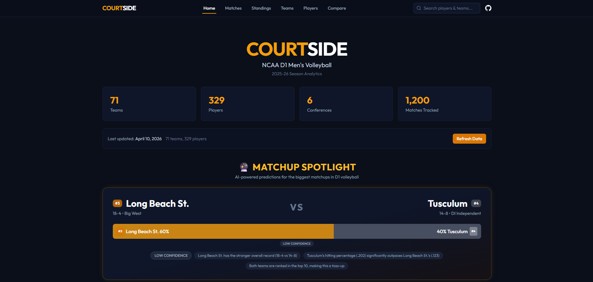

# CourtSide 🏐

**NCAA D1 Men's Volleyball Analytics Dashboard — 2025-26 Season**

Real-time team rankings, player leaderboards, head-to-head comparisons, and AI-powered match predictions for all 71 NCAA D1 men's volleyball programs.



---

## What It Does

CourtSide scrapes live statistical data from the NCAA, normalizes it into a PostgreSQL database, and serves an interactive analytics dashboard. A weighted logistic regression model predicts match outcomes between any two teams using 7 performance features, surfacing the most compelling matchups automatically.

**The problem it solves:** NCAA men's volleyball has no centralized analytics platform. Stats are scattered across conference pages and hard-to-navigate NCAA tables. CourtSide consolidates everything into a single, fast, searchable interface with predictions.

## Demo

> **Live:** _Coming soon_ · **Repo:** [github.com/riyonp23/CourtSide](https://github.com/riyonp23/CourtSide)

---

## Features

- **Coaches Poll Rankings** — Accurate top-20 rankings with overall and conference-grouped views
- **Player Leaderboards** — Sortable across 14 stat categories (kills/set, hitting %, aces/set, etc.) with conference filtering and search
- **Player Comparison** — Side-by-side stat profiles with radar chart visualization for up to 4 players
- **Team Comparison** — Head-to-head team analytics with aggregated roster stats and radar charts
- **Match Predictions** — AI-powered win probability model using weighted logistic regression across 7 features (win%, hitting%, kills, blocks, aces, assists, coaches poll rank)
- **Featured Matchups** — Auto-generated most compelling predictions ranked by competitiveness
- **Custom Matchup Builder** — Pick any two teams and get an instant prediction with key factor explanations
- **Team Detail Pages** — Full roster with individual stats, championship history, and coaches poll rank badges
- **Player Detail Pages** — Percentile bars showing where a player ranks across all D1 players
- **Conference Drill-Down** — Conference-specific standings and top performers
- **Live Scraper Progress** — WebSocket-powered real-time progress bar during data refreshes
- **Universal Search** — Search players and teams from any page via the navbar
- **Championship History** — 13 programs with national title counts and years displayed
- **Shareable Compare URLs** — Pre-populated comparison links via query parameters

## Tech Stack

| Layer | Technologies |
|---|---|
| **Frontend** | React 18, TypeScript, Tailwind CSS, Recharts, Vite |
| **Backend** | Fastify, Prisma ORM, PostgreSQL, WebSockets (ws) |
| **Data Pipeline** | Custom NCAA scraper, Cheerio, Node.js |
| **ML** | Weighted logistic regression (TypeScript, no external ML library) |

## Architecture

```
courtside/
├── client/          React 18 + Vite + Tailwind — dark broadcast-style UI
│   ├── components/  24 reusable components (PredictionBar, MatchupCard, etc.)
│   ├── pages/       9 pages (Home, Matches, Standings, Teams, Players, Compare, etc.)
│   └── lib/         Typed API client + shared types
├── server/          Fastify REST API + WebSocket server
│   ├── routes/      8 route modules (teams, players, standings, compare, predict, scraper)
│   └── lib/         Prisma singleton, ML predictor engine, WebSocket manager
└── scraper/         NCAA data pipeline
    ├── teams.ts     Team list + W-L record scraper
    ├── roster.ts    Player stats from national ranking pages
    └── rankings.ts  Coaches Poll + championship history (hardcoded authoritative data)
```

**Data flow:** Scraper pulls from `stats.ncaa.org` ranking endpoints → normalizes into PostgreSQL via Prisma → Fastify serves typed REST API → React frontend renders with Recharts visualizations. ML predictor caches team profiles in memory and computes predictions in <100ms.

## Prediction Model

The match predictor uses a weighted logistic regression with 7 input features:

| Feature | Weight | Rationale |
|---|---|---|
| Win % | 4.0 | Strongest single predictor of team quality |
| Hitting % | 2.5 | Volleyball's most predictive offensive metric |
| Kills/Set | 1.0 | Raw offensive output |
| Blocks/Set | 0.8 | Net defense differentiator at D1 level |
| Aces/Set | 0.6 | Free-point serving advantage |
| Assists/Set | 0.4 | Ball distribution and setter quality |
| Rank Diff | 0.3 | Coaches' poll reputation tiebreaker |

Predictions include confidence levels (high/medium/low) and 3-4 human-readable key factor explanations.

## Getting Started

```bash
git clone https://github.com/riyonp23/CourtSide.git
cd CourtSide
npm install
```

Set up a free PostgreSQL database at [neon.tech](https://neon.tech), then:

```bash
# Add your connection string
echo 'DATABASE_URL="your-neon-connection-string"' > server/.env

# Migrate, scrape NCAA data, and start
cd server && npx prisma migrate dev --name init && cd ..
npm run scrape
npm run dev:all
```

Open `http://localhost:5173` — the client runs on port 5173, API on port 3001.

## Data Source

All statistics sourced from [stats.ncaa.org](https://stats.ncaa.org) national ranking pages for the 2025-26 NCAA D1 Men's Volleyball season. Covers **71 teams**, **329+ players**, and **6 conferences**. Coaches Poll rankings and championship history sourced from NCAA.com and verified against official records.

---

Built by [Riyon Praveen](https://github.com/riyonp23)