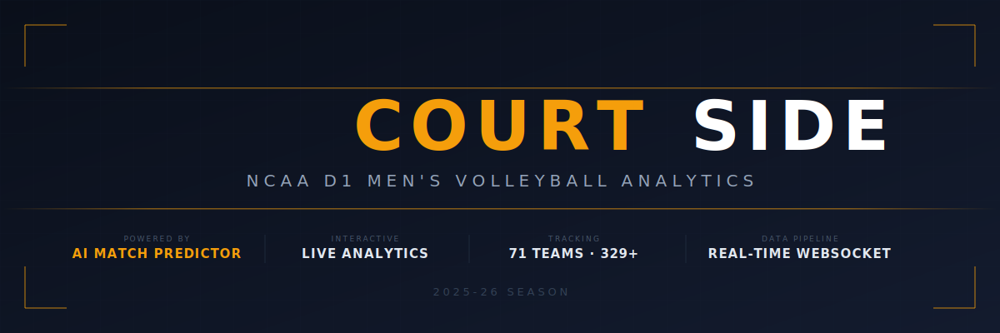

<div align="center">



[](https://court-side-client.vercel.app)

[](https://reactjs.org/)
[](https://typescriptlang.org/)
[](https://fastify.dev/)
[](https://postgresql.org/)
[](https://prisma.io/)
[](https://developer.mozilla.org/en-US/docs/Web/API/WebSockets_API)

[Overview](#-overview) · [Features](#-features) · [Prediction Model](#-prediction-model) · [Architecture](#-architecture) · [Tech Stack](#-tech-stack) · [Getting Started](#-getting-started)

</div>

---

## 📌 Overview

CourtSide is a full-stack analytics dashboard for NCAA D1 Men's Volleyball that scrapes live statistical data from the NCAA, normalizes it into a PostgreSQL database, and serves an interactive dashboard with AI-powered match predictions.

The core engineering challenge: the NCAA has no public API for men's volleyball — data is scattered across server-rendered HTML tables behind Akamai bot protection. CourtSide solves this with a custom **multi-source scraping pipeline** that pulls from 7 national ranking endpoints, normalizes 329+ player stat profiles across 71 teams, and funnels everything into a typed Prisma schema. A **weighted logistic regression model** then predicts match outcomes between any two teams using 7 performance features.

> Built as a personal project combining competitive volleyball experience with full-stack engineering.


---

## ✨ Features

| Feature | Description |
|---|---|
| 🏆 **Coaches Poll Rankings** | Accurate top-20 rankings with overall and conference-grouped standings views |
| 📊 **Player Leaderboards** | Sortable across 14 stat categories with conference filtering, search, and pagination |
| ⚡ **Player Comparison** | Side-by-side stat profiles for up to 4 players with radar chart visualization |
| 🏐 **Team Comparison** | Head-to-head team analytics with aggregated roster stats and radar charts |
| 🔮 **Match Predictions** | Weighted logistic regression model across 7 features with confidence levels and key factor explanations |
| 📡 **Live Scraper Progress** | WebSocket-powered real-time progress bar during NCAA data refreshes |
| 🔍 **Universal Search** | Search players and teams from any page via the navbar |
| 🏅 **Championship History** | National title counts and years for 13 historically winning programs |
| 🔗 **Shareable Compare URLs** | Pre-populated comparison links via query parameters |
| 📱 **Responsive Dark UI** | Broadcast-style dark theme optimized for desktop and mobile |

---

## 🔮 Prediction Model

The match predictor uses a weighted logistic regression with 7 input features to compute win probability between any two teams:

| Feature | Weight | Rationale |
|---|---|---|
| Win % | 4.0 | Strongest single predictor of team quality |
| Hitting % | 2.5 | Volleyball's most predictive offensive metric — kill efficiency minus errors |
| Kills/Set | 1.0 | Raw offensive output volume |
| Blocks/Set | 0.8 | Net defense differentiator at the D1 level |
| Aces/Set | 0.6 | Free-point serving advantage |
| Assists/Set | 0.4 | Ball distribution and setter quality indicator |
| Rank Diff | 0.3 | Coaches' poll reputation tiebreaker — weighted low to avoid circular reasoning |

Predictions include confidence levels (high >70%, medium 60-70%, low <60%) and 3-4 human-readable key factor explanations. Featured matchups are auto-generated and ranked by competitiveness (closest to 50/50). The model runs entirely in TypeScript — no external ML library, just `sigmoid(weighted_sum)` over stat differentials. Predictions compute in <100ms with in-memory team profile caching.

---

## 🏗️ Architecture

```
┌─────────────────────────────────────────────────────────────┐
│                     React 18 Frontend                       │
│  ┌──────────┐ ┌──────────┐ ┌──────────┐ ┌──────────────┐   │
│  │  Home    │ │ Matches  │ │Standings │ │   Compare    │   │
│  │(Spotlight│ │(Predictor│ │(Rankings │ │(Players +    │   │
│  │ + Stats) │ │+ Builder)│ │+ Confrnc)│ │ Teams + Radar│   │
│  └────┬─────┘ └────┬─────┘ └────┬─────┘ └──────┬───────┘   │
│       │            │            │               │           │
│  ┌────▼────────────▼────────────▼───────────────▼────────┐  │
│  │           Typed API Client (fetch wrapper)            │  │
│  └────────────────────────┬──────────────────────────────┘  │
└───────────────────────────│─────────────────────────────────┘
                            │  REST + WebSocket
┌───────────────────────────▼─────────────────────────────────┐
│                     Fastify API Server                      │
│  ┌──────────┐ ┌──────────┐ ┌──────────┐ ┌──────────────┐   │
│  │  Teams   │ │ Players  │ │Standings │ │  Predict     │   │
│  │  Routes  │ │  Routes  │ │  Routes  │ │  Routes      │   │
│  └────┬─────┘ └────┬─────┘ └────┬─────┘ └──────┬───────┘   │
│       │            │            │               │           │
│  ┌────▼────────────▼────────────▼───────────────▼────────┐  │
│  │         Prisma ORM (typed queries, zero raw SQL)      │  │
│  └────────────────────────┬──────────────────────────────┘  │
│                           │                                 │
│  ┌────────────────────────▼──────────────────────────────┐  │
│  │  ML Predictor Engine (sigmoid + weighted features)    │  │
│  │  WebSocket Manager (live scraper broadcast)           │  │
│  └───────────────────────────────────────────────────────┘  │
└───────────────────────────│─────────────────────────────────┘
                            │
                    ┌───────▼───────┐
                    │  PostgreSQL   │
                    │  (Neon Cloud) │
                    └───────┬───────┘
                            │
┌───────────────────────────▼─────────────────────────────────┐
│                     NCAA Scraper Pipeline                    │
│                                                             │
│   stats.ncaa.org ──→ Cheerio HTML Parser ──→ Normalizer     │
│   (7 ranking          (team list, W-L        (fuzzy name    │
│    endpoints)          records, player        matching,      │
│                        stat tables)           type coercion) │
│                                                    │        │
│   Coaches Poll (hardcoded) ──→ Rank Applicator ────┤        │
│   Championship History ──────→ Title Applicator ───┘        │
└─────────────────────────────────────────────────────────────┘
```

### Key Engineering Decisions

**Multi-Source Scraping Pipeline**
The NCAA has no public API for men's volleyball. Individual team pages are protected by Akamai bot detection. CourtSide works around this by pulling from 7 national ranking endpoints (`stats.ncaa.org/rankings/national_ranking`) — kills, hitting %, assists, aces, digs, blocks, points — and cross-referencing player records across all categories to build complete stat profiles. The pipeline is idempotent (safe to re-run via upserts) and completes in ~8 seconds.

**Weighted Logistic Regression**
Rather than importing a heavy ML library, the predictor is pure TypeScript math — a sigmoid function over weighted stat differentials. Team profiles are cached in memory on first request and recomputed only when data is refreshed. This keeps prediction latency under 100ms while running on a free-tier server.

**WebSocket Live Progress**
When a data refresh is triggered (via the dashboard or CLI), the server spawns the scraper as a child process and broadcasts structured progress events over WebSocket. Connected clients render a real-time progress bar without polling — a genuine use of WebSockets, not a fabricated one.

**Hardcoded Authoritative Data**
Coaches Poll rankings and championship history are intentionally hardcoded rather than scraped. These come from official NCAA sources that are either JS-rendered (unscrapeable) or static historical records. Hardcoding ensures accuracy and eliminates a fragile scraping dependency for data that changes weekly at most.

---

## 🛠️ Tech Stack

### Frontend
| Technology | Purpose |
|---|---|
| React 18 | UI framework with hooks |
| TypeScript | Strict mode, zero `any` types |
| Tailwind CSS | Dark broadcast-style theme |
| Recharts | Radar charts, data visualizations |
| Vite | Build tool & dev server |
| React Router v7 | Client-side routing (9 pages) |

### Backend
| Technology | Purpose |
|---|---|
| Fastify 5 | REST API framework (8 route modules) |
| Prisma 6 | Type-safe PostgreSQL ORM |
| PostgreSQL 17 | Primary database (Neon cloud) |
| WebSocket (ws) | Live scraper progress broadcast |
| Cheerio | HTML parsing for NCAA scraping |
| Node.js | Scraper pipeline runtime |

### Infrastructure
| Technology | Purpose |
|---|---|
| Vercel | Frontend hosting (free tier) |
| Render | Backend hosting (free tier) |
| Neon | Managed PostgreSQL (free tier) |

---

## 🚀 Getting Started

### Prerequisites

- Node.js 18+
- PostgreSQL database ([Neon](https://neon.tech) free tier works)

### 1. Clone & Install

```bash
git clone https://github.com/riyonp23/CourtSide.git
cd CourtSide
npm install
```

### 2. Configure Database

```bash
cp .env.example server/.env
# Edit server/.env with your Neon connection string
```

### 3. Migrate & Scrape

```bash
cd server && npx prisma migrate dev --name init && cd ..
npm run scrape
```

### 4. Run

```bash
npm run dev:all
```

The client runs on `http://localhost:5173` and the API on `http://localhost:3001`.

---

## 📂 Project Structure

```
CourtSide/
├── client/                     React 18 + Vite + Tailwind
│   ├── src/
│   │   ├── components/         19 reusable components
│   │   │   ├── PredictionBar   Animated win probability visualization
│   │   │   ├── MatchupCard     Full matchup display with key factors
│   │   │   ├── FeaturedMatchups Spotlight hero section for Home page
│   │   │   ├── PlayerTable     Sortable stat table with mobile scroll
│   │   │   ├── NavSearch       Universal player + team search
│   │   │   ├── AnimatedNumber  Count-up animation (easeOutExpo)
│   │   │   └── ...
│   │   ├── pages/              9 page components
│   │   │   ├── Home            Dashboard with spotlight + stats + top 10
│   │   │   ├── Matches         Featured predictions + matchup builder
│   │   │   ├── Standings       Overall rankings + conference view tabs
│   │   │   ├── Players         Paginated leaderboard (14 stat categories)
│   │   │   ├── Compare         Player + team comparison with radar charts
│   │   │   ├── PlayerDetail    Percentile bars across all D1 players
│   │   │   ├── TeamDetail      Roster + championship history
│   │   │   └── ...
│   │   ├── lib/api.ts          Typed fetch wrapper (10 API functions)
│   │   └── types.ts            Shared TypeScript interfaces
│   └── public/favicon.svg
│
├── server/                     Fastify 5 + Prisma + WebSocket
│   ├── src/
│   │   ├── routes/             8 route modules
│   │   │   ├── teams.ts        GET /api/teams, /api/teams/:id
│   │   │   ├── players.ts      GET /api/players (paginated, filterable, searchable)
│   │   │   ├── standings.ts    GET /api/standings (conference grouping)
│   │   │   ├── compare.ts      GET /api/compare?ids=...
│   │   │   ├── predict.ts      GET /api/predict, /api/predict/featured
│   │   │   ├── scraper.ts      POST /api/scrape (async + WebSocket progress)
│   │   │   └── health.ts       GET /api/health
│   │   └── lib/
│   │       ├── predictor.ts    Weighted logistic regression engine
│   │       ├── prisma.ts       Singleton Prisma client
│   │       └── ws.ts           WebSocket broadcast manager
│   └── prisma/schema.prisma    4 models: Team, Player, Match, PlayerSeasonStats
│
├── scraper/                    NCAA data pipeline
│   ├── src/
│   │   ├── teams.ts            Team list + W-L record scraper
│   │   ├── roster.ts           Player stats from 7 ranking endpoints
│   │   ├── rankings.ts         Coaches Poll + championship history
│   │   ├── utils.ts            Retry logic, rate limiting, User-Agent
│   │   └── index.ts            Pipeline orchestrator with progress callbacks
│   └── package.json
│
├── docs/
│   ├── banner.svg
│   └── screenshot.png
├── .env.example
├── .gitignore
├── render.yaml                 Render deployment blueprint
└── README.md
```

---

## 📊 Data Source

All statistics sourced from [stats.ncaa.org](https://stats.ncaa.org) national ranking pages for the **2025-26 NCAA D1 Men's Volleyball** season. The dataset covers **71 teams**, **329+ players**, and **6 conferences**. Coaches Poll rankings sourced from the AVCA weekly poll. Championship history verified against official NCAA records spanning 1970-2025.

---

## 👤 Author

**Riyon Praveen** — Computer Science, University of South Florida (Class of 2027)

[](https://linkedin.com/in/riyonpraveen)
[](https://github.com/riyonp23)

---

## 📄 License

This project is licensed under the MIT License — see [LICENSE](LICENSE) for details.

---

<div align="center">
  <sub>Built by a volleyball player who wanted better analytics for his sport.</sub>
</div>